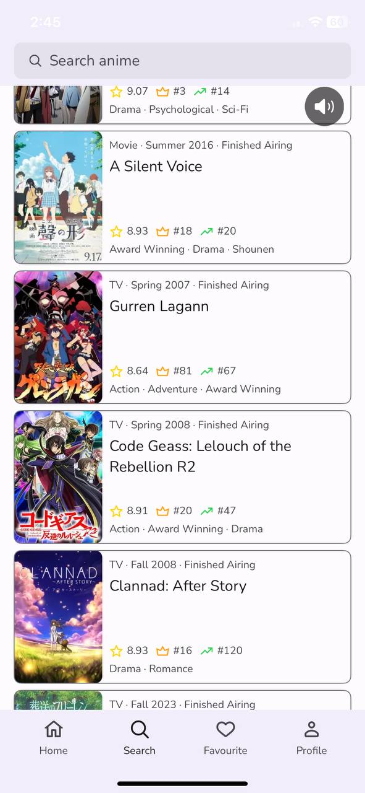
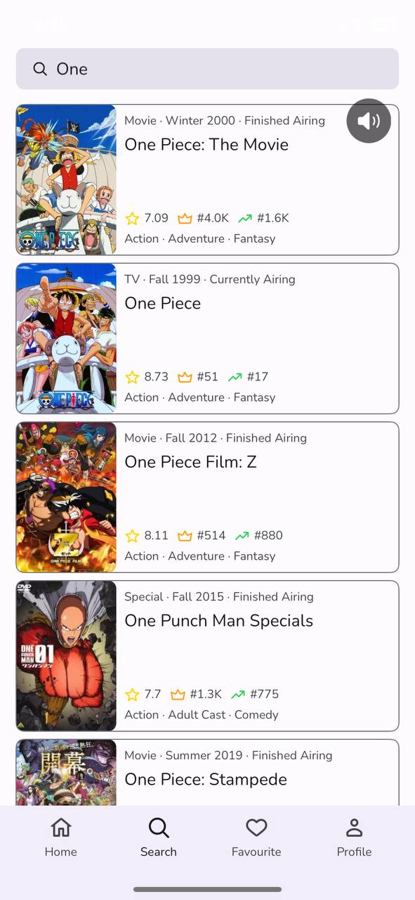
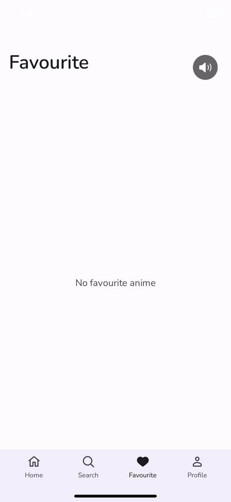

# YumeSekai-iOSApp
YumeSekai-iOSApp
<h1 align="center">🌙 YumeSekai - iOS App</h1>

**YumeSekai** lets you discover anime anytime, anywhere. Whether you're a seasoned anime fan or new to the genre, YumeSekai helps you explore and keep track of the anime you love with rich information and an intuitive interface.

---

## ✨ Features

- 📺 **Browse Popular & Trending Anime**  
  Explore top airing, upcoming, most popular, and top-rated anime — all in one place.

- 🔍 **Smart Anime Search**  
  Find anime by title using either **English** or **Rōmaji**. Filter through thousands of titles with ease.

- ❤️ **Create Your Favorite List**  
  Add your favorite anime to a personal list for quick access whenever you want.

- 📝 **Detailed Anime Information**  
  Get to know anime titles with info like **season**, **score**, **rank**, **adaptation source**, **synopsis**, and more.

- 🌐 **Bilingual Language Support**  
  Available in **English** and **Bahasa Indonesia**.  
  > Bahasa Indonesia support is limited to some features and requires changing your device’s system language.

- 📲 **Clean SwiftUI Interface**  
  Built with **SwiftUI** for a modern, fast, and responsive user experience.

---

<p align="center">
  
</p>
<p align="center">
  *App Features.*
</p>

---

## 🧭 App Sections

### 🏠 Home
- Top Airing Anime  
- Top Upcoming Anime  
- Most Popular Anime  
- Top Rated Anime

### 🔍 Search
- Top Favorite Anime  
- Search by Title (English or Rōmaji)

### ⭐ Favorite
- View and manage your list of favorited anime

### 👤 Profile
- User Profile Info (Picture, Name, Website Link)  
- Terms of Service  
- Privacy Policy  
- App Version

---

## 📊 Dependency Diagram

<p align="center">
  
</p>
<p align="center">
  *App Dependency Diagram.*
</p>

---

## 🛠️ Installation:

To run this project locally:

1. Clone the repository:
    ```bash
    git clone https://github.com/deepanshubajaj/YumeSekai-iOSApp.git
    ```

2. Open the project in Xcode:
    ```bash
    open Yume.xcodeproj
    ```

3. Build and run the app on a simulator or physical device.

> Make sure you have Xcode installed and configured properly to run the project.

---

## 🛠 Technologies Used:

- 🛠️ **SwiftUI** — Used for designing the user interface.  
- 🧪 **Xcode** — Used for development, testing, and debugging.  
- 🔄 **Remote APIs** — For data management and online functionality.  
- 💻 **Swift** — The core programming language powering the app.

---

## ⚙️ Data Reference

- 🌐 **API Source** — Data is fetched from the [MyAnimeList API](https://myanimelist.net/apiconfig), providing reliable and up-to-date anime information including titles, scores, rankings, and more.
- 🔄 **Project Usage**: Add your own Client ID (API token) from [MyAnimeList](https://myanimelist.net/apiconfig) Value by adding the file env.swift in the project in the following format.

    ```bash
    // env.swift

    import Foundation

    public enum AppConfigMain {
        private static let bundle = Bundle.main
    
        public static var API_KEY: String {
            return bundle.getValue(for: "API_KEY") ?? "Your_API_Token"
        }
        public static let EMAIL = "Your_Email_Id"
        public static let GIT_LINK = "Your_GITHUB_Link"
        public static let MY_WEBSITE = "Your_WEBSITE_Link"
    }
    ```

---

## 🎨 App Look:

<p align="center">
  
</p>
<p align="center">
  *App snapshot in the simulator.*
</p>

---

## 🖼️ Screenshots:

<p align="center">
  
  
</p>

<p align="center">
  
  
  
</p>

<p align="center">
  *Splash screen displayed upon app launch.*
</p>


##


<p align="center">
    
    
    
</p>

##

<p align="center">
    
    
    
</p>

##

<p align="center">
    
    
    
</p>

##

<p align="center">
    
    
    
</p>

##

<p align="center">
    
    
    
</p>

##

<p align="center">
    
    
    
</p>

##

<p align="center">
    
    
    
</p>

##

<p align="center">
    
    
    
</p>

##

<p align="center">
    
    
    
</p>

##

<p align="center">
    
    
    
</p>

##

<p align="center">
    
    
    
</p>

##

<p align="center">
    
    
    
</p>

##

<p align="center">
    
    
    
</p>

##

<p align="center">
    
    
    
</p>

<p align="center">
  *Screenshots of the YumeSekai App showing different screens*
</p>

---

## 📱 App Icon:

<p align="center">
  
</p>
<p align="center">
  *The app icon reflects the YumeSekai look*
</p>

---

## 🚀 Video Demo:

Here’s a short video showcasing the app's functionality:

<p align="center">
  
  
</p>

➤ <a href="ProjectOutputs/WorkingVideo/SplashScreen1.MP4">🎬 Watch Splash Screen Video</a>

➤ <a href="ProjectOutputs/WorkingVideo/WorkingVideo1.MP4">🎥 Watch Working Video 1</a>

➤ <a href="ProjectOutputs/WorkingVideo/WorkingVideo2.MP4">🎥 Watch Working Video 2</a>

---

## 🤝 Contributing

Thank you for your interest in contributing to this project!  
I welcome contributions from the community.

- You are free to use, modify, and redistribute this code under the terms of the **Apache-2.0 License**.
- If you'd like to contribute, please **open an issue** or **submit a pull request**.
- All contributions will be reviewed and approved by the author — **[Deepanshu Bajaj](https://github.com/deepanshubajaj?tab=overview&from=2025-03-01&to=2025-03-31)**.

---

### 📌 How to Contribute

To contribute:

1. Fork the repository.

2. Create a new branch:
   ```bash
    git checkout -b feature/your-feature-name
   ```

3. Commit your changes:
   ```bash
    git commit -m 'Add your feature'
   ```

4. Push to the branch:
   ```bash
    git push origin feature/your-feature-name
   ```

5. Open a pull request.

---

## 📃 License

This project is licensed under the [Apache-2.0 License](./LICENSE).  
You are free to use this project for personal, educational, or commercial purposes — just make sure to provide proper attribution.

> **Clarification:** Commercial use includes, but is not limited to, use in products,  
> services, or activities intended to generate revenue, directly or indirectly.